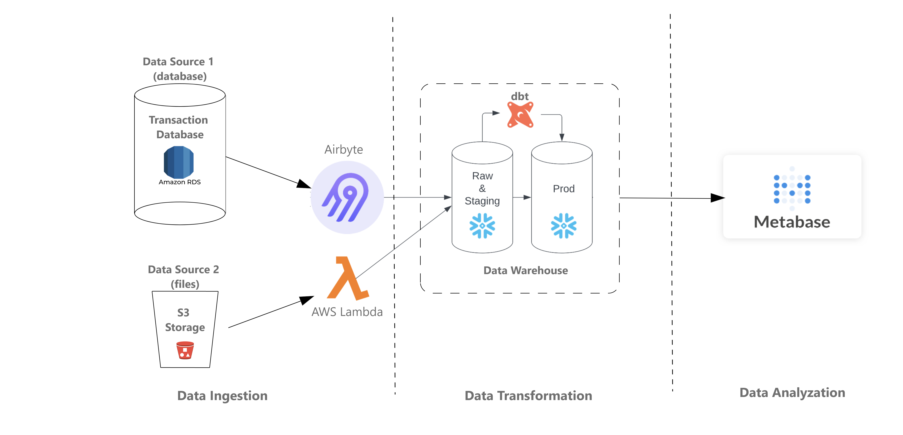
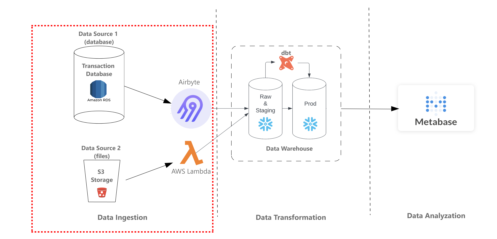
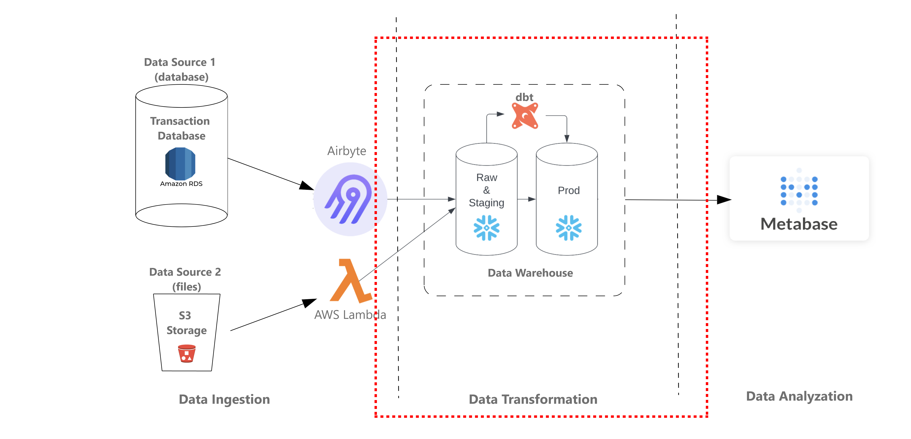
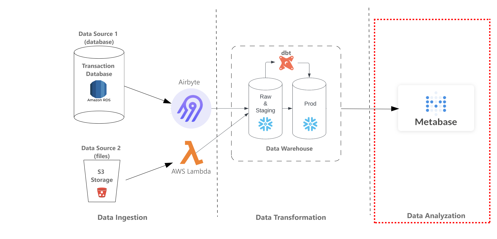

# 📊 Analytical Data Engineering Project

---

## 📑 Table of Contents

1. [Project Overview](#-project-overview)
2. [About the Data](#-about-the-data)

   * [Data Background](#21-data-background)
   * [Tables in the Dataset](#22-tables-in-the-dataset)
3. [Business Requirements](#-business-requirements)

   * [Snowflake Data Warehouse](#31-snowflake-data-warehouse-requirements)
   * [Metabase Dashboards](#32-metabase-requirements)
4. [Project Infrastructure](#-project-infrastructure)
5. [Part One: Data Ingestion](#-part-one-data-ingestion)
6. [Part Two: Data Transformation](#-part-two-data-transformation)
7. [Part Three: Data Analysis](#-part-three-data-analysis)
8. [Tech Stack](#-tech-stack)
9. [Next Steps](#-next-steps)

---

## 📌 Project Overview

This project demonstrates a **cloud-based Analytical Data Engineering pipeline**.

* Data ingested from **AWS RDS (Postgres)** and **AWS S3**.
* Transformed inside **Snowflake** using **DBT**.
* Visualized with **Metabase** for BI insights.

🔹 **Goal:** To create a scalable, production-grade analytical data pipeline for retail sales and inventory insights.

📊 **High-level diagram** 

---

## 📊 About the Data

### 2.1 Data Background

Dataset: **TPCDS Benchmark Dataset (Retail Sales)**

* **Sales records:** From websites & catalogs.
* **Inventory levels:** Across multiple warehouses.

**Sources:**

* **Postgres (AWS RDS):** All tables except inventory, refreshed daily.
* **S3 Bucket:** Inventory CSV dumped daily, typically weekly snapshots.

### 2.2 Tables in the Dataset

* Schemas available in **Snowflake**.
* Customer-related tables integrated into a **single Customer Dimension** during ETL.

[Table Schema](https://docs.google.com/spreadsheets/d/1VilJCLyUveI68jcVrLFXxV5JjcUehj4NjvrHJRGIx5g/edit?usp=sharing)

---

## 🏢 Business Requirements

### 3.1 Snowflake Data Warehouse Requirements

* Integrate raw tables (e.g., customer-related) into one.
* Create fact tables with metrics:

| Metric               | Description                 | Formula                                         |
| -------------------- | --------------------------- | ----------------------------------------------- |
| `sum_qty_wk`         | Weekly total sales quantity | `SUM(sales_quantity)`                           |
| `sum_amt_wk`         | Weekly total sales amount   | `SUM(sales_amount)`                             |
| `sum_profit_wk`      | Weekly net profit           | `SUM(net_profit)`                               |
| `avg_qty_dy`         | Avg. daily sales quantity   | `sum_qty_wk / 7`                                |
| `inv_on_hand_qty_wk` | Weekly end inventory        | Weekly closing balance                          |
| `wks_sply`           | Weeks of supply             | `inv_on_hand_qty_wk / sum_qty_wk`               |
| `low_stock_flg_wk`   | Stock alert                 | If `(avg_qty_dy > inv_on_hand_qty_wk)` → `True` |

### 3.2 Metabase Requirements

* Identify **top/bottom performers** (by sales amount/quantity).
* Display **low-supply items per week**.
* Detect **low-stock items**, flagging week & warehouse as `"True"`.

---

## ☁️ Project Infrastructure

This project is built entirely in the **cloud (AWS)**.

* **AWS RDS (Postgres):** Raw source data.
* **AWS S3:** Inventory CSV dumps.
* **Airbyte:** Ingest Postgres → Snowflake.
* **AWS Lambda:** Ingest S3 → Snowflake.
* **DBT:** Transform raw → curated models.
* **Snowflake:** Central data warehouse.
* **Metabase:** BI dashboards.

---

## ⚙️ Part One: Data Ingestion

📌 **Flow:**

1. **Airbyte → Snowflake** (RDS schema `raw_st`).
2. **AWS Lambda → Snowflake** (inventory.csv).

---

## 🔄 Part Two: Data Transformation

📌 **Flow:**

* DBT models for integration, fact/dim creation, metrics.
* Scheduled jobs for daily refresh.
* Transformation lineage tracked in DBT.

---

## 📈 Part Three: Data Analysis

📌 **Flow:**

* Connect **Snowflake → Metabase**.
* Build dashboards & reports for:

  * Weekly top/bottom sales performers.
  * Low supply & low stock alerts.

---

## 🚀 Tech Stack

| Component      | Tool                |
| -------------- | ------------------- |
| Cloud          | AWS                 |
| Data Warehouse | Snowflake           |
| Ingestion      | Airbyte, AWS Lambda |
| Transformation | DBT                 |
| Visualization  | Metabase            |

---

## 📌 Next Steps

* [ ] Add **ER diagrams** & **data models**.
* [ ] Upload **Metabase dashboard screenshots**.
* [ ] Implement **CI/CD** for DBT & Airbyte.
* [ ] Add **monitoring & alerting** for pipeline health.

---

