# Project Creation Steps
This file contains the steps followed to create this project

* **Project Host Machine**: Zara_de EC2 instance
* **Lecture Source** : Refer to the notes from [here](https://github.com/sanyassyed/De_Coursework_WCD/blob/master/docs/1AnalyticsEngineering.md)
    * **Part 1 & 2** - Airbyte, Lambda & Project Data Ingestion - Week 4 Lecture 2
    * **Part 3** - EDA on Snowflake - Week 7 Lecture 1 

## Tools & Setup Required
* `S3` 
    * USE: to get `inventory.csv` from the WeCloudData Bucket
* `Snowflake Console` 
    * CREATE
        * an account
        * Raw Database & Staging
        * Production Database
    * USE: To load data 
* `snowsql` - Snowflake CLI on `host EC2 instance (zara_de)`
    * INSTALLATION: Install via [Makefile](../../Makefile) in home directory of the `host EC2 instance (zara_de)` or Instructions in `Week 4 Lecture 1 Notes/Video`
    * USE: To manage snowflake from host machine via CLI
* `AWS Lambda`
    * USE: To pull data from S3 and load into snowflake on a schedule
* EC2 Instance with `dbt` [Note: we are using `host EC2 instance (zara_de)`]
    * INSTALLATION: Install `dbt-pg` via [Makefile](../setupfiles/Makefile_zara_de) in the home folder or Install via instructions in `Week 1 Lab EC2 and Linux`
    * USE: To transform the data in Snowflake
* Host EC2 (zara_de) with `psql` - 
    * INSTALLATION: Install via [Makefile](../setupfiles/Makefile_zara_de) in the home folder or Instructions in `Week 1 Lab EC2 and Linux`
    * USE: The psql will be used to connect to Postgres database if necessary.
* Host EC2 (zara_de) with `aws-cli` - 
    * INSTALLATION: Install via [Makefile](../setupfiles/Makefile_zara_de) in the home folder
    * USE:
        * The aws-cli will help us connect to aws via command line.
        * Eg: Create & Upload lambda layer
* `RDS Postgres`
    * USE: To pull another dataset provided by WeCloudData
* EC2 Instance with `Airbyte`
    * CREATE: 
        * Create t2.xlarge instance with 32GB Memory called `Airbyte` via instructions in `Week 1 Lab EC2 and Linux`
        * SSH port 22
        * TCP port 8000
        * `ssh Airbyte -L 8000:localhost:8000`
    * INSTALL: 
        * make
        ```bash
        sudo apt update
        sudo apt install make
        ```
        * `docker` & `docker-compose` via 
            * [Makefile](../setupfiles/Makefile_airbyte) `make install-docker`, `make install-compose` & `make post-install`
            * Follow instructions in `Week 2 Lab Install Airbyte and Metabase with Docker`
        * `Airbyte` via abctl
            * [Makefile](../setupfiles/Makefile_airbyte) `make install-abctl`, `make start-airbyte`, `make stop-airbyte` & `make restart-airbyte`
            * Get Login details using the command `abctl local credentials` ( first time user set username: s*****een@gmail.com organization:airbyte)
    * USE: To pull data from RDS into snowflake
* EC2 Instance with `Metabase`
    * CREATE: Create t2.small instance `Metabase` via instructions in `Week 1 Lab EC2 and Linux`
    * INSTALL: 
        * `docker` & `docker-compose` via 
            * Makefile (copy the applicable code & create a Makefile in the Airbyte instance) or
            * Follow instructions in `Week 2 Lab Install Airbyte and Metabase with Docker`
        * `Metabase` via docker
    * USE: To visualize the data pulled from snowflake

---

## Part 1 : s3 -> Lambda -> Snowflake
In this step we are trying to do the following everyday at 2 am via Lambda functions `EventBridge` Trigger
1. Pulls the `inventory.csv` file from WCD's S3 bucket via `REQUEST PAYER` accessed via user secret and key and writes is locally to the `/tmp` folder
1. Lambda then creates `comma_csv` file format & a named stage called `INVENTORY_STAGE`
1. Puts the .csv file from the `/tmp` to the `INVENTORY_STAGE` named stage
1. Truncates the inventory table
1. Copies the `inventory_stage/inventory.csv.gz` from the `INVENTORY_STAGE` named stage into the `inventory` table

### Step 1 : Pre-requisite
* **Host Machine**: environment to build the lambda layer
    * conda
    * aws cli
    * snowsql
* **AWS Console**:
    * User eg: `guest` with the following custom policy eg:`S3ReadWriteExternal` to let the user read from and write to external account s3 buckets
    * Create the access key for the user and save the user key and secret to use in the lambda function later to be able to access the external s3 bucket witht the data i.e `inventory.csv`
    * optionally you can add the user `guest` to the user group `guest_group` to stay organised
    ```json
    {
    "Version": "2012-10-17",
    "Statement": [
        {
            "Effect": "Allow",
            "Action": [
                "s3:GetObject",
                "s3:ListBucket",
                "s3:PutObject",
                "s3:DeleteObject"
            ],
            "Resource": "*"
        }
    ]
    }
    ```
### Step 2: Snowflake 
* Instructions in `Week 4 - Exercise 1-Snowflake` & `Week 4 - Lecture 2 - Airbyte, Lambda & Project Data Ingestion` Notes
* NOTE: - Snowflake is case sensitive if string is within quotes. For example these two are different schemas `TPCDS."raw"` and `TPCDS.RAW`
* Use the warehouse - `compute_wh`
* In the snowflake console create the following:
    * Code can be viewed in the following worksheet on snowflake [Midterm_Retail_Project/1_setup](../script/snowflake/1_setup.sql)
    * Database - `tpcds`
    * Schema - `raw`
    * New User - `wcd_midterm_load_user` (give password too)
    * Grant role- `accountadmin`
    * Table - `inventory`
    * NOTE: Changes from the lecture:
        * Make sure when writing the `inventory` table schema the `inv_warehouse_sk` column has `NULL` not `NOT NULL` as the column condition & `DEFAULT 0`
        * Remember the default value only applies when inserting into table and not when copying (like we do with the `COPY INTO` command when copying data from stage to table)

### Step 3: Lambda Function Creation
* Goto AWS console
* Create the lambda function `wcd-de-b8-snowflake-project` (Code for the same can be found [here](../script/lambda_function.py))
* Use `config.toml` to save the parameters for `snowflake`, `aws` & `s3` found [here](../script/config.toml)
* Use the `guest` user key & secret to access the s3 bucket via `REQUEST PAYER`
* Write the code to do the following
    * pull data file from url using requests
    * write the file locally to `/tmp` folder on lambda
    * create file format on snowflake - here give the additional attribute to handle nulls `NULL_IF = ('')`
    * create stage on snowflake
    * put file from `/tmp` to snowflake stage
    * list stage
    * copy data from stage to table
* Deploy and test the lambda functions to know which packages are missing in lambda that you need to add to the layer
* Add the required packagest to be added to the lambda layer along with the versions to the [requirements.txt](../script/requirements.txt) file on the host machine
* Create layer (to zip packages required by lambda)
    * Use an EC2 instance or cloud console to do that using the following code
    ```bash
    # goto a folder where you want to create - the virtual env & folder for storing the lambda layers lambda_layers
    # create a folder for the script
    mkdir script
    cd script
    mkdir -p lambda_layers/python/lib/python3.12/site-packages

    # create vitual env for lambda functions unsing the same python version as the lambda function
    conda create --prefix ./.venv python=3.12 pip -y
    # activate virtual env
    conda activate .venv

    # upgrade pip, setuptools and wheel
    pip install --upgrade pip setuptools wheel

    # install the packages into lambda_layers/python/lib/python3.12/site-packages using the virtual env python
    pip install -r requirements.txt --target lambda_layers/python/lib/python3.12/site-packages/. 

    # view the versions of the packages installed
    pip freeze --path lambda_layers/python/lib/python3.12/site-packages/

    # zip the packages for lambda i.e everything in the lambda_layers folder into a zip file named snowflake_lambda_layer.zip
    cd lambda_layers/
    zip -r snowflake_lambda_layer.zip *

    # publish layer so it is available on the aws console under lambda layers
    aws lambda publish-layer-version \
        --layer-name fl-snowflake-lambda-layer \
        --compatible-runtimes python3.12 \
        --zip-file fileb://snowflake_lambda_layer.zip
    ```
* Attach the created layer `fl-snowflake-lambda-layer` to the lambda function via the AWS Console 
    * Go down the page of the lambda function to the `Layer` section 
    * Select the `Add a Layer` button
    * Custom Layers
    * Select `fl-snowflake-lambda-layer`
    * Version: 1
* Increase the processing capacity of the lambda funciton as follows:
    * Goto the `Configuration` tab
    * Select `Edit`
    * Increase `memeory` to maximum `3008` is the free account limit otherwise increase to `10240`
    * Increase `Ephemeral Storage` to `10240`
    * `Timeout` to 15 mins
    * `Save`
* Test the lambda function:
* After the test in snowflake you will see the following:
    * File Format named `comma_csv`
    * Named Stage called `inventory_stage` with the `inventory.csv.gz`
    * Data loaded into the table `tpcds.raw.inventory` with `10710000` rows

### Step 4 : Scheduling using EventBridge Trigger
* We are going to set `EventBridge` in the Lambda function to make it run on every night 2 am EST (6 AM UTC).
* Select the trigger button
* From the drop down box select `EventBridge (CloudWatch Events)`
* Create a new rule named `trigger-2am-EST`
* For `Schedule expression` write the following CRON schedule `cron(0 6 * * ? *)`
* `Add` Button
* **Now the lambda function is able to pull data from the s3 bucket and load it into snowflake every day at 2 am EST**

### Codes:
* Lambda Function [lambda_funtion](../script/lambda_function.py)
* Config file [config.toml](../script/config.toml)
* Requirements File [requirements.txt](../script/requirements.txt)
* Snowflake Worksheet [Wk4_Lec2_Retail_Project worksheet]

---

## Part 2: RDS Postgres -> Airbyte -> Snowflake
In this step we are trying to do the following everyday at 2 am via Airbyte
1. Pulls the 18 tables from RDS(Postgres) 
1. Loads the tables into the staging/landing schema `airbyte_internal` 
1. Loads the tables from the `airbyte_internal` schema into the `raw` schema via `CREATE TABLE` & `INSERT INTO`

### Tools
* Host EC2 instance (zara_de)
* Airbyte in `Airbyte` EC2 t2.xlarge instance with 20GB memory

### Step 1: Setup & Start Airbyte
* Start Airbyte using the command `abctl local start`
* Follow the steps in the [Wk 4 [Workshop] Airbyte](https://learn.weclouddata.com/programs/2/courses/159d75b6-f529-492e-9c48-8d16f33a8183/weeks/2500/materials/19647?topic_id=6566)
* Create Source - Postgres
    * 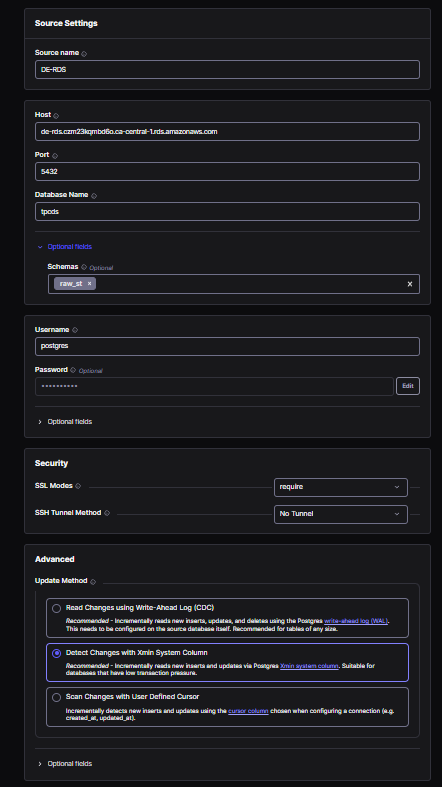
    * Find username (postgres) and password in [this](https://learn.weclouddata.com/programs/2/courses/159d75b6-f529-492e-9c48-8d16f33a8183/weeks/2500/materials/19644?topic_id=6565) lecture at 1:39
    * For `Security` `SSL Modes` select `allow`
    * In connections for cron give `0 0 6 * * ?`
    * For Airbyte [playground]( https://demo.airbyte.io/workspaces/55c39a0b-037d-406c-a1ac-00393b055f18/connections): 
         * For Advanced Update Method select ~`Scan Changes with User Defined Cursor`~ `Detect Changes with Xmin System Column`
         * SSL Modes as `require`
* Create Destination - Snowflake
   * 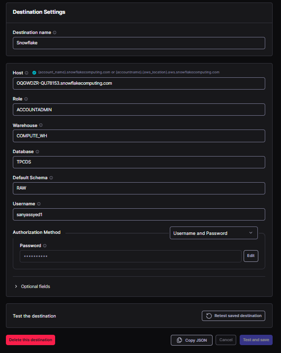
   * Host: Account/Server URL of your Snowflake account
* Create Connection
   * 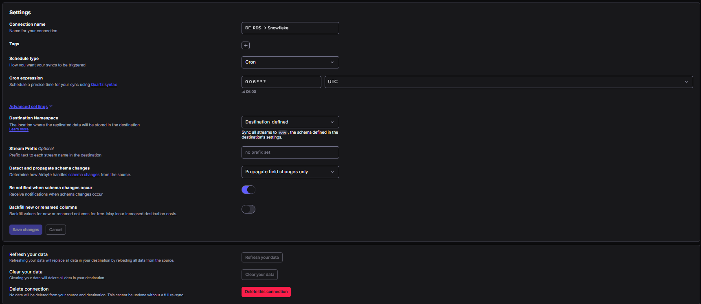
   * In the `Configure Connection` stage select `Full refresh | Overwite` to get rid of the `primary key missing` error
* Sync Now - The data is now loaded from source to destination and this load happens every day at 2 am
    
* ERRORS:
    * `502 ERROR`: If you get `502` error follow the below steps [resource](https://github.com/airbytehq/airbyte/issues/65567) 
    ```bash
    # Had to also set the token by hand like this - this is in parts lifted from the slack channel

    docker ps

    # Find your container id

    docker exec -it <containerID> bash

    # Now inside the container do this

    # Check current status
    kubectl -n airbyte-abctl get pods

    # Generate and apply matching auth tokens to both services
    BEARER_TOKEN=$(openssl rand -hex 16)
    echo "Generated token: $BEARER_TOKEN"

    kubectl -n airbyte-abctl set env deployment/airbyte-abctl-worker \
    WORKLOAD_API_BEARER_TOKEN="$BEARER_TOKEN" \
    INTERNAL_API_AUTH_TOKEN="$BEARER_TOKEN"

    kubectl -n airbyte-abctl set env deployment/airbyte-abctl-workload-api-server \
    WORKLOAD_API_BEARER_TOKEN="$BEARER_TOKEN"

    # Restart both services
    kubectl -n airbyte-abctl rollout restart deployment airbyte-abctl-worker
    kubectl -n airbyte-abctl rollout restart deployment airbyte-abctl-workload-api-server

    # Wait for rollouts to complete
    kubectl -n airbyte-abctl rollout status deployment airbyte-abctl-worker
    kubectl -n airbyte-abctl rollout status deployment airbyte-abctl-workload-api-server
    ```

    * `Airbyte - ABCTL Error`: 
        * abctl install works well
        * `abctl local install --host ubuntu --low-resource-mode` installation of airbyte works fine the first time but when restarting (we use the same command) gives the following permission errors:
            * `PG DATA ERROR`: If you get `ERROR failed to determine if any previous psql version exists: error reading pgdata version file: open /home/ubuntu/.airbyte/abctl/data/airbyte-volume-db/pgdata/PG_VERSION: permission denied` error run the following command on the Airbyte instance. 
                * `SOLUTION` (does not always work): 
                * `sudo chown -R ubuntu:ubuntu /home/ubuntu/.airbyte`
                * Check if the owner of the following directories is ubuntu `ls -ld /home/ubuntu/.airbyte` and `ls -ld /home/ubuntu/.airbyte/abctl/data/airbyte-volume-db/pgdata` 
            * `MinIO ERROR`: `ERROR failed to determine if minio physical volume dir exists: stat /home/ubuntu/.airbyte/abctl/data/airbyte-minio-pv: permission denied`
                * `sudo chown -R 999:999 /home/ubuntu/.airbyte/abctl/data` & `sudo chmod -R 755 /home/ubuntu/.airbyte/abctl/data`
        * The only work around is remove the volume as well as they are errors due to the access to the volume directory `abctl local uninstall --persisted`
    * AIRBYTE CONNECTION NOTES ERROR - Primary Key Missing - Select `SYNC Mode` as `Full Refresh | Overwrite`

---

## Datawarehouse contents after the above steps
* Database : TPCDS
* SCHEMA
    * RAW
        * Tables:
            * INVENTORY - loaded from WCD's s3 bucket via Lambda Function everyday via `EventBridge Trigger` by creating an `INVENTORY_STAGE` named stage & `COMMA_CSV` file format in the raw shema and putting the file in the named stage and then copying into the table, 
            * CALL_CENTER - loaded via Airbyte CRON job everyday into the `airbyte_internal` schema as a landing schema and then copying the tables into the `RAW` schema 
            * CATALOG_PAGE
            * CATALOG_SALES
            * CUSTOMER
            * CUSTOMER_ADDRESS
            * CUSTOMER_DEMOGRAPHIC
            * DATE_DIM
            * HOUSEHOLD_DEMOGRAPHIC
            * INCOME_BAND
            * INVENTORY
            * ITEM
            * PROMOTION
            * SHIP_MODE
            * TIME_DIM
            * WAREHOUSE
            * WEB_PAGE
            * WEB_SALES
            * WEB_SITE
        * Stages
            * INVENTORY_STAGE
        * File Formats
            * COMMA_CSV
    * AIRBYTE_INTERNAL
        * Tables
            * 18 Tables
* We now have 18 + 1 Tables in the DW in the RAW Schema
  
---

## Data RE-LOAD
* Due to the Snowflake account expiring and Airbyte installation on EC2 instance is incurring large costs we do the following
   * Create another snowflake account
   * Create an airbyte account [here]( https://demo.airbyte.io/workspaces/55c39a0b-037d-406c-a1ac-00393b055f18/connections) 
* Load the inventory.csv again using Lambda function `wcd-de-b8-snowflake-project`
    * Run the [script](../script/snowflake/1_setup.sql) to create the DB `TPCDS` & schema `RAW` in Snowflake
    * Change the snowflake details in config for `account identifier`
    * Run the lambda code by selecting `Deploy` & `Test`
    * `Inventory` table in now loaded into TPCDS.RAW schema in Snowflake
    * * NOTE: We are not turning on the EventTrigger as we don't want to be charged for daily data EL
* Use Airbyte to load the other 18 tables

---
## Part 3: EDA and Data Modelling in Snowflake
* We have ingested data from RDS and S3 bucket to Snowflake RAW schema
* In this part we look at the data in detail by understanding the data background, tables in the data and then model the data using the Kimball Data Modelling methodology

### Data Background
* TPC-DS Dataset:
    * It is a standardised Dataset which is used to test Datawarehouse efficiency. Eg: to comapare BigQuery vs Snowflake vs Databricks etc.
    * More info on the dataset [here](https://www.fivetran.com/blog/warehouse-benchmark)
* About: 
    * Sales records from the website and catalog
    * Inventory level of each item in each warehouse
    * 15 dimensional tables with info on cutomers, warehouse, items, etc
    * Stored by splitting into two parts
        * RDS: All the tables except for the inventory tables are stored in the Postgres DB in AWS RDS. The tables will be refreshed every day and updated with the newest data for sales data, so in order to get the newest data, you need to run ETL processes every day.
        * S3 Bucket: The single Inventory table is stored in an S3 bucket, every day there will be a new file containing the newest data dump into the S3 bucket. BUT, be aware that the inventory table usually only records the inventory data at the end of each week, so usually each week you can only see one entry for each item each warehouse (Please go to your RAW schema in Snowflake to explore the data). But you also need to ingest the inventory file from the S3 bucket every day.
* Tables:
    * View the raw data schema [here](./Tables.xlsx)
    * In this sheet, you can see there are several tables correlated to the customer; these tables' schema is arranged horizontally.
    * This means when you are doing ETL consider putting integrate all these tables into one customer dimension table.
* Find more info about eda instructions and data background [here](./eda_and_data_description.pdf)

### EDA
* Explore the dataset from the following aspects: sql code [here](../script/snowflake/2_eda.sql) 
    * SQL commands to do the following can be found here [Midterm_Retail_Project/2_eda](../script/snowflake/2_eda.sql)
    * The earliest and latest date of the sales and inventory (you need to join date_dim to see the exact date instead of date id)
    * Row numbers of each table
    * Pick one item to know how frequently it is ordered by customers and how frequently it is recorded in the inventory
    * How many individual items
    * How many individual customers
    * etc.

#### Data Modelling
* Excel with Data Dictionary, DB Schema, DW Schema is in [tpcds_schema_by_sanya.xlsx](./tpcds_schema_by_sanya.xlsx)
* Make **Data dictionary** using tools like to add coulumn descriptions
    * `documentation in dbt`
    * `Collibra`
    * `DataHub`
    * `Excel`
* Or add descriptions directly to the table and columns on Snowflake using the following commands
    * `COMMENT ON TABLE / COLUMN` [more info](https://docs.snowflake.com/en/sql-reference/sql/comment)
* Make a ERD (Entity Relationship Diagram) of the dataset if not available using tools like
    * `Lucid` (also lets you convert the ERD to DDL)
    * `Draw.io`
    * 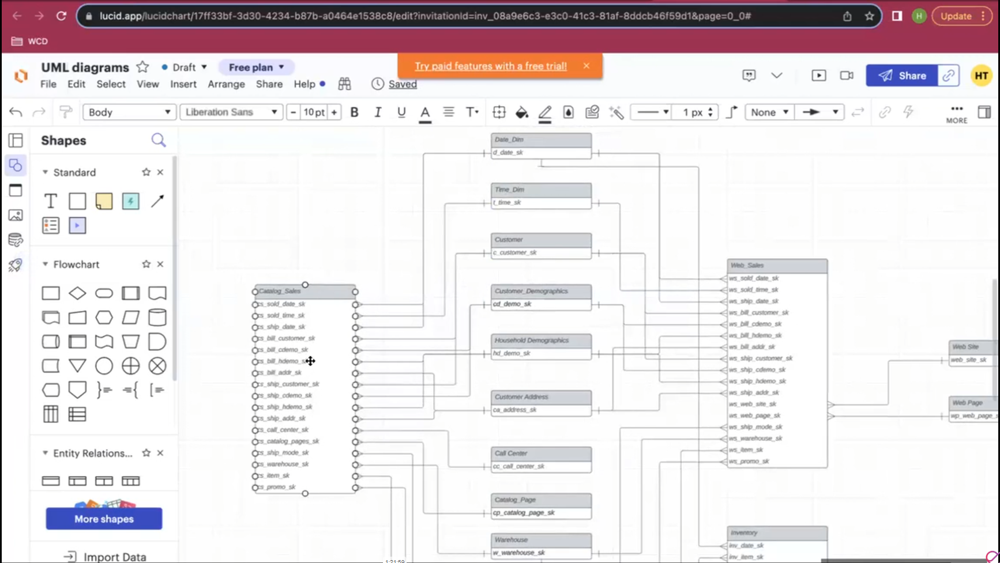
    * 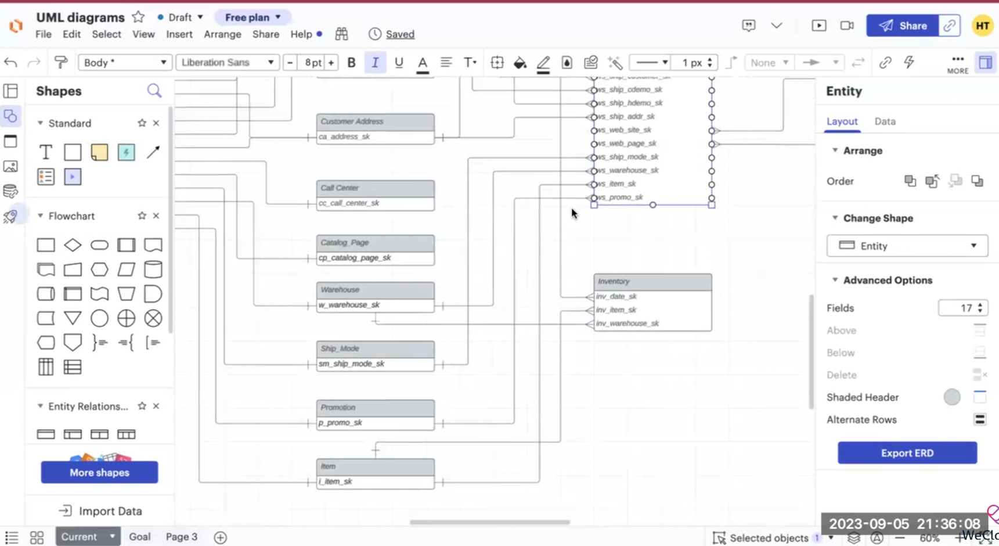
    * The data models from documentation of the TPC-DS from [here](https://www.tpc.org/tpc_documents_current_versions/pdf/tpc-ds_v2.13.0.pdf)
    * 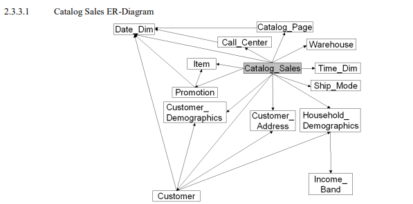
    * 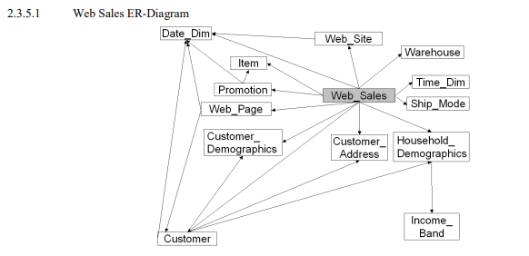
    * 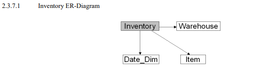
* Perform the next stages of Data Modelling (Conceptual, Logical & Physical models)
    * Conceptual Model: 
        * Done [here](../script/snowflake/2_eda.sql) & the above excel sheet
        * Identify the Grain: 
            * look at the business requirements
            * item should also be included in the grain otherwise it will not make sense what the total quantity is for
            * include warehouse also in the dimension as requirement states it wants to know *inventory on hand at the end of each week in all warehouses*
    * Logical Model 
        * Done [here](../script/snowflake/2_eda.sql) & the above excel sheet
        * Choose the Dimensions:
            * Customer Dimension: 
                * integrate it and prepare it for SCD Type 2 (currently it does not store history) 
                * it will include the following tables - `Customer`, `Customer_address`, `Customer_demographics`, `Household_demographics` & `Income_band`
                * Question to ask: 
                    * Option 1: - Type 2 SCD only on customer table and create `Customer Intermediate` table  and then join other tables
                        * **This is the approach taken**
                        * Type 2 SCD only on customer table i.e. do want to maintain the history only in the customer table
                        * Snowflake Schema: If we want history of only customer table then we do SCD Type 2 on only the customer table and then later join the address, etc. In this case the address info etc will be over written but info like customer birthdate, names etc (Which are in the customer table) will have history
                        * 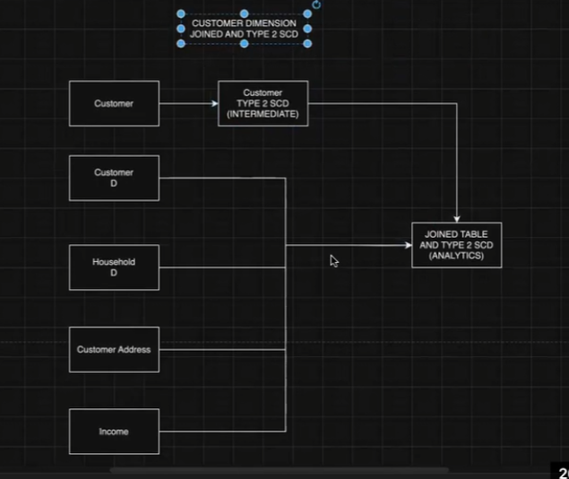
                    * Option 2: Join all the tables and then do Type 2 SCD
                        * So you can maintain history on all
                        * Star Schema: If we maintain history for all the above tables we first join them all and then do Type 2 SCD
                        * 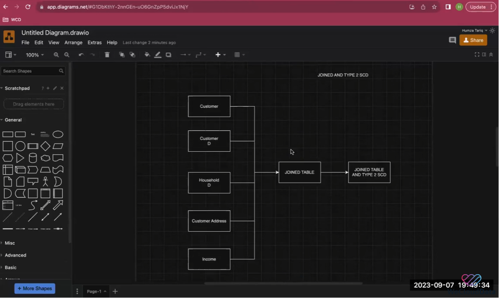 
        * Choose the Measure
            * Question to ask:
                * Option 1: 
                    * Union & Join all fact tables (catalogue_sales -daily data, web_sales -daily data, inventory - weekly data) into one `Weekly Sales Inventory` table
                    * Join is very expensive
                    * Any issues will only be found in the bigger table; as there is no intermediate table where we can perform checks
                    * 
                * Option 2: 
                    * * **This is the approach taken**
                    * Union the daily catalog_sales and web_sales into `Daily Sales Aggregated` and then JOIN this with the weekly inventory table to get the `Weekly Sales Inventory`
                    * Final join will be smaller than in the previous option
                    * More modular as the aggregated table can be used to create another fact table
                    * Issues can be detected in the aggregated table
                    * 
        * NOTE: 
            * These `Intermediate` (Customer) and `Aggregated` (Daily Sales Aggregate) tables are store in a schema called `INTERMEDIATE`
            * We don't want to expose these table to the end user therefore we keep it away in a seperate schema
            * So we have `RAW` -> `INTERMEDIATE` -> `ANALYTICS`(ENTERPRISE)
    * Physical Model - **NON-DBT APPROACH**
        * ***NOTE:*** 
            * We are going to practice manual transformation in Snowflake; 
            * Therefore we create a copy of TPCDS DB called `SF_TPCDS` to do the next steps
            * TPCDS will be used to perform tranformations with `dbt`
        * Create the two schemas `INTERMEDIATE` (hidden from the end user eg: data analyst ect) & `ANALYTICS` (ENTERPRISE Schema) in `SF_TPCDS`
        * Use `Excel` [tpcds_schema_by_sanya.xlsx](./tpcds_schema_by_sanya.xlsx), `Lucid` or `draw.io` to draw the star schema 
        * 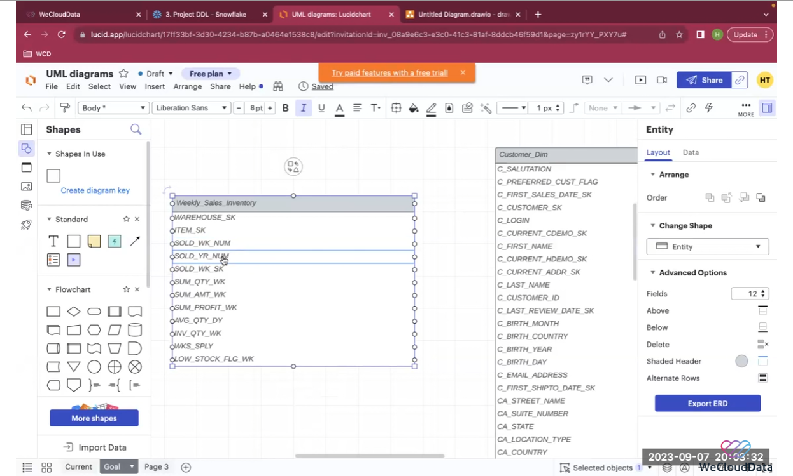
        * 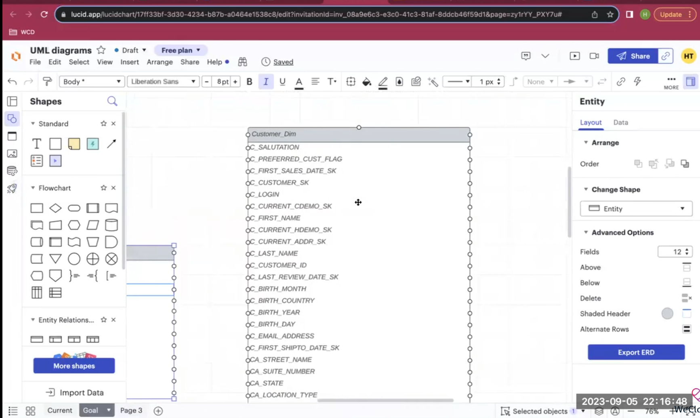
        * TODO: Data Dictionaty in Excel [here](./tpcds_schema_by_sanya.xlsx)
        * DDL [script](./script/snowflake/3_ddl.sql) to **CREATE** the following tables
            * INTERMEDIATE SCHEMA
                * dim_customer_intermediate (`customer` table Type 2 SCD)
                * fact_daily_sales_aggregated (UNION `catalogue_sales` & `web_sales`)
            * ANALYTICS SCHEMA
                * dim_customer (`dim_customer_intermediate`, LEFT JOIN `customer_address`, `customer_demographics`, `household_demographics` & `income_band`)
                * fact_weekly_sales_inventory (`fact_daily_sales_aggregated`, `inventory`)
                * ~~dim_calendar~~
                * ~~dim_item~~
                * ~~dim_warehouse~~
            * BEST PRACTICES:
                * Keep the timezone as `TIMESTAMP_NTZ` because you want to keep the time in UTC; any timezone conversions should be done in the very last stage
        * DML to **LOAD** the following tables using the **Incremental Load** DATA LOADING Methodology
            * dim_customer [script](../script/snowflake/4_dml_dim_customer.sql)
                * `dim_customer_aggregate TRANSITION TABLE` - `Initial Load` & `Delta Load` - Same script for INSERT & UPDATE - Type 2 SCD
                * `dim_customer` - Insert code
                * GRAIN: Each row contains the auto increment customer_sk and all other customer related data
                * `RAW.customer` -TYPE 2 SCD-> `INTERMEDIATE.dim_customer_intermediate` LEFT JOINS `customer_address`, `customer_demographics`, `household_demographics` & `income_band` --> `ANALYTICS.dim_customer`
            * fact_daily_sales_aggregated [script](../script/snowflake/5_dml_fact_daily_sales_aggregated.sql)
                * RUN DAILY
                * `RAW.catalogue_sales` UNION `RAW.web_sales` LEFT JOIN `RAW.date_dim` --> `INTERMEDIATE.fact_daily_sales_aggregated` 
            * fact_weekly_sales_aggregated [script](../script/snowflake/6_dml_fact_weekly_sales_inventory.sql)
                * RUN WEEKLY
                * `INTERMEDIATE.fact_daily_sales_aggregated` INNER JOIN `RAW.date_dim` LEFT JOIN `RAW.inventory` --> `ANALYTICS.fact_weekly_sales_inventory`
            * **NOTE:** : Future Improvements
                * Add the calendar, item and warehouse dimensions so we join to these dim tables rather than the raw tables
                * Add auto increment surrogate keys to all the dimensions and facts and name the current `sk` rows as `sk_natural`


#### Retail Project Terminologies
* 🔑 Quick Memory Guide
    - **List Price** = Before discount  
    - **Net Price / Sale Price** = After discount  
    - **Net Cost** = Seller’s cost  
    - **Final Cost** = What the buyer actually pays after adding shipping & tax  
* ✅ Full Example Walkthrough
    - **List Price:** $1000  
    - **Discount:** $200  
    - **Net Price / Sale Price (after discount):** $800  
    - **Seller’s Net Cost:** $600  
    - **Profit:** $200 (800 – 600)  
    - **Shipping:** $20  
    - **Tax:** $40  
    - **Final Cost (buyer pays):** $860  

[Project Source Repo](https://github.com/WCD-DE/AE_Project_Student/tree/main)


## Improvements
* Create lambda function via AWS CLI rather than the AWS Console

## Resources:
* Course Github for project [here](https://github.com/WCD-DE/AE_Project_Student/tree/main/project_lambda_function)


